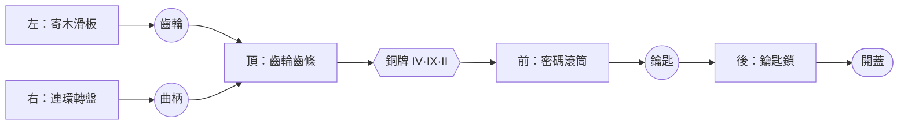
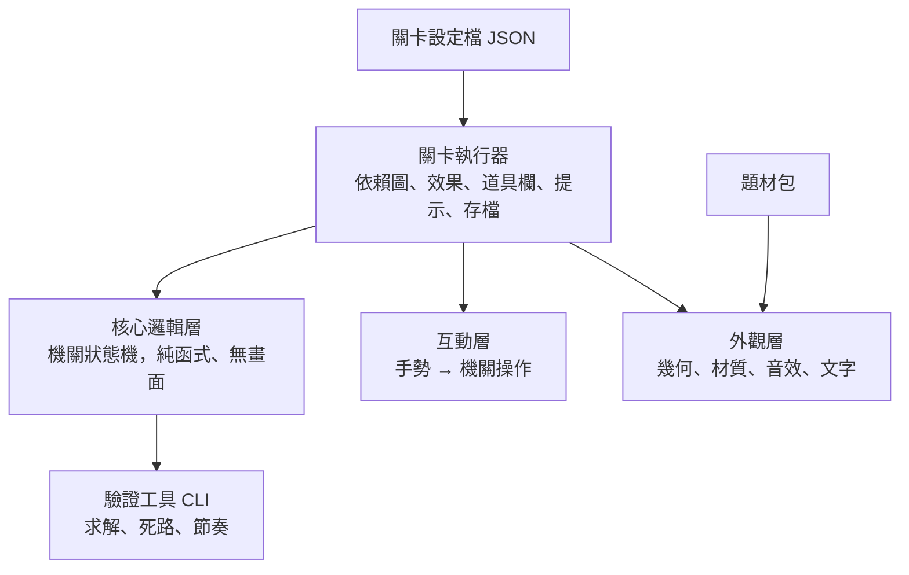

# 機關解謎系列｜規劃書

| 項目 | 內容 |
|---|---|
| 版本 | v0.1 草案 |
| 日期 | 2026-09-28 |
| 狀態 | 規劃中：先建地基（元件庫、公式、關卡格式），題材尚未決定 |
| 原型 | [`prototype/v0-five-locks.html`](../prototype/v0-five-locks.html)（五重機關盒，單檔 Three.js） |

---

## 目錄

0. [摘要](#0-摘要)
1. [背景與目標](#1-背景與目標)
2. [解構：解謎的公式](#2-解構解謎的公式)
3. [結構化關卡](#3-結構化關卡)
4. [元件庫架構](#4-元件庫架構)
5. [可擴充性](#5-可擴充性)
6. [可變化性](#6-可變化性)
7. [設計元素與差異化](#7-設計元素與差異化)
8. [開發路線](#8-開發路線)
9. [風險與待決事項](#9-風險與待決事項)
- 附錄 A–C：原型拆解、名詞表、參考資料

---

## 0. 摘要

**要做的事**：把「3D 實體機關解謎」拆成可重組的零件，建成一套**機關元件庫＋關卡描述格式＋自動驗證工具**。之後換上一個市場上還沒人用過的題材，做成系列遊戲。

**核心主張**：

1. **邏輯、互動、外觀三層分離**：同一個「連環轉盤」的邏輯，可以套上黃銅轉盤的外觀，也可以套上渾天儀的外觀。換題材只換外觀層。
2. **關卡即資料**：一個盒子＝一份 JSON。依賴圖、線索、密碼都寫在資料裡，不寫死在程式中。
3. **可以被機器驗證**：每個機關都用純函式描述狀態轉移，所以能自動求解、檢查有沒有死路、算出最短解，並自動產生分層提示。
4. **變化來自四個軸**：參數、組合、外觀、規則修飾。同一批元件可以產出大量不同的關卡。

**先不做**：多人連線、公開的關卡編輯器、營利機制、原生 App 上架。這些等地基驗證完再評估。

---

## 1. 背景與目標

### 1.1 緣起

v0 原型「五重機關盒」驗證了三件事：

- 瀏覽器裡用 Three.js 做實體機關解謎，**手感和畫面都成立**。
- 五種機關（滑板、轉盤、齒輪、密碼、鑰匙）雖然各自寫死，但**結構高度相似**：都有狀態、解開條件、解開後的獎勵。
- 原型裡轉盤的提示是**用求解器即時算出來的**。這證明「機關可求解 → 提示可自動產生」這條路走得通。

原型的限制：全部寫在一個檔案裡，機關、關卡流程和外觀糾纏在一起，做第二個盒子就得複製貼上再改。

### 1.2 目標

| # | 目標 | 可驗收的標準 |
|---|---|---|
| G1 | 元件化 | 原型的 5 種機關都改寫成獨立元件，彼此不互相引用 |
| G2 | 關卡資料化 | 只靠一份設定檔就能重現五重機關盒，行為和原型一致 |
| G3 | 可驗證 | CLI 能對任一關卡輸出：可解／不可解、最短步數、死路清單 |
| G4 | 可擴充 | 新增一種機關只要動「新增檔案＋註冊」，不必修改核心 |
| G5 | 可變化 | 同一份關卡結構用不同種子（seed）產出不同密碼與初始狀態，而且保證可解 |
| G6 | 題材可替換 | 同一份關卡套兩套外觀，邏輯完全不動 |

### 1.3 非目標（第一階段）

- 公開的關卡編輯器（內部先用 JSON＋驗證工具）
- 多人、雲端存檔、帳號
- 手工 3D 建模的美術管線（先沿用程序化幾何，外觀層預留換模型的介面）

---

## 2. 解構：解謎的公式

### 2.1 最小單位：一道鎖

每一道機關都能拆成四個欄位：

```
一道鎖 ＝ 動作（手做什麼） × 知識（腦要知道什麼） × 獎勵（解開得到什麼） ＋ 回饋（過程中的反應）
```

- **動作**決定「好不好玩」：觸感、物理感、操作的滿足感。
- **知識**決定「難不難」：玩家需要推理出什麼。
- **獎勵**決定「接下來去哪」：推動整體流程往前。
- **回饋**決定「會不會卡到放棄」：錯了要知道錯，對了要有爽感。

設計一道新謎題，就是從四個欄位各挑一個，再檢查組合是否自然。

### 2.2 動作（玩家操作語彙）

「手勢」是輸入層的事，「物理隱喻」是玩家感受到的東西。兩者要分開看，因為同一個手勢可以代表很多種隱喻。

| 手勢 | 物理隱喻 | 原型已有 |
|---|---|---|
| 點擊 | 按下、撥一格、切換、拾取 | ✔ 轉盤、滾筒、拾取 |
| 軸向拖曳 | 推、拉、滑動 | ✔ 寄木滑板 |
| 旋轉拖曳 | 搖曲柄、轉旋鈕、撥指針 | ✔ 曲柄 |
| 長按 | 蓄力、壓住、持續加熱 | — |
| 道具→目標 | 插入、裝上、放置、倒入 | ✔ 齒輪、曲柄、鑰匙 |
| 道具→道具 | 組合、拆解 | — |
| 觀察 | 拉近、繞到側面、透過鏡片看 | ✔ 視角切換（無鏡片） |
| 裝置傾斜（選配） | 傾倒、滾動、平衡 | — |

**原則**：每種手勢都要有「明顯的可操作暗示」，例如滑板一端的小圓孔、游標變成抓手、懸停時微亮。

### 2.3 鎖型（解開條件的類型）

| 鎖型 | 解開條件 | 典型例子 |
|---|---|---|
| 密碼 | 多個值同時等於目標 | 滾筒、鐘面時間、撥盤 |
| 鑰匙 | 持有特定道具並使用 | 鑰匙、印章、硬幣 |
| 順序 | 操作要照正確順序 | 寄木滑板、按鈕序列、旋律 |
| 對齊 | 多個會連動的部件同時到位 | 連環轉盤、多層轉盤 |
| 狀態 | 一組開關達到特定組合 | 撥桿組（Lights Out 型） |
| 缺件 | 補上零件才能運作 | 齒輪組缺一顆 |
| 路徑 | 連出一條通路 | 管路、光路、迷宮 |
| 門檻 | 某個量達到目標 | 天秤、水位、溫度 |
| 排列 | 把零件排成目標配置 | 滑塊拼圖、榫卯拆解 |
| 時機 | 在正確時間點操作 | 擒縱、節拍（少用，會增加挫折感） |

### 2.4 知識（線索類型）

| 類型 | 說明 | 例子 |
|---|---|---|
| 直給 | 答案直接寫出來 | 牌子上寫 492 |
| 轉換 | 要經過一次編碼轉換 | 羅馬數字 IV·IX·II → 492（原型用這個） |
| 空間對應 | 線索的位置或形狀對應答案 | 圖上的點對應按鈕位置 |
| 隱藏 | 需要特殊方式才看得到 | 透視鏡、背光、特定角度 |
| 計數 | 從環境中數出來 | 盒上有幾隻鳥 |
| 交叉參照 | 兩條線索合起來才完整 | 顏色表＋數字表 |
| 推理 | 從規則推出唯一解 | 「藍在紅左邊」型的邏輯題 |
| 機制理解 | 理解機關本身的規則 | 連環轉盤的連動關係 |

**間接層數**是難度的主要來源：直給＝0 層，轉換＝1 層，隱藏加轉換＝2 層。一般關卡控制在 0–2 層，高潮關卡最多 3 層。

### 2.5 獎勵

| 類型 | 作用 | 例子 |
|---|---|---|
| 道具 | 放進道具欄，之後使用 | 齒輪、曲柄、鑰匙 |
| 資訊 | 揭露線索 | 擋板滑開露出銅牌 |
| 通道 | 開啟新的可操作區域 | 抽屜、暗格、新的一面 |
| 啟用 | 讓另一個機關能動 | 齒輪裝上後曲柄才有作用 |
| 敘事 | 推進故事 | 信件、日記、影像 |
| 終局 | 關卡結束 | 開蓋、水晶亮起 |

### 2.6 回饋

| 時機 | 做法 | 原型已有 |
|---|---|---|
| 被擋住 | 抖一下＋悶響＋一句話說明為什麼 | ✔ |
| 部分正確 | 局部亮起或發聲（例如一個滾筒對了就發光） | — 可加 |
| 解開 | 清脆機械聲＋動畫＋清單打勾 | ✔ |
| 卡住很久 | 提示按鈕閃一下（不主動跳出） | — 可加 |

「部分正確」的回饋要謹慎：給太多會讓密碼類謎題淪為暴力試誤。預設關閉，由關卡設定決定是否開啟。

### 2.7 組合規則（設計檢查清單）

1. **一鎖一啊哈**：每道鎖只要求一個關鍵理解。
2. **線索可達**：玩家碰到一道鎖之前，一定有辦法取得解開它需要的知識。
3. **沒有「月亮邏輯」**：答案必須能從遊戲內的資訊推出來，不靠外部常識或讀心術。羅馬數字這種廣為人知的常識可以用，但要給暗示。
4. **獎勵必被使用**：拿到的每個道具最後都要用上。系列後期可以刻意留一個伏筆道具到下一集用。
5. **先教、再考、後變**：新機制先單獨出現，再放進正式謎題，最後加一個反轉。
6. **動作與知識分開考**：一道鎖若操作很難，知識就要簡單，反之亦然。
7. **錯誤可逆**：不能出現「做錯就永遠解不開」的軟鎖死（soft-lock）。

### 2.8 難度的旋鈕

| 旋鈕 | 往上調的效果 |
|---|---|
| 狀態空間 | 暴力試誤的成本變高（3 輪×10 格＝1,000 種；4 輪＝10,000 種） |
| 間接層數 | 需要的推理步驟變多 |
| 同時開放的支線數 | 1 條＝保姆式引導；2–3 條＝有自由感；超過 4 條＝容易迷失 |
| 連動複雜度 | 連環轉盤的連動矩陣越密，越需要理解機制 |
| 隱藏程度 | 線索越難發現 |
| 精準度要求 | 拖曳時需要對得越準（建議保持低，避免挫折） |

之後在驗證工具裡把這些旋鈕量化成**難度分數**（見 3.6）。

---

## 3. 結構化關卡

### 3.1 謎題依賴圖

每個關卡都是一張**有向無環圖**（DAG，Directed Acyclic Graph）。這種畫法源自冒險遊戲設計常用的「謎題依賴圖」（Puzzle Dependency Chart，Ron Gilbert 推廣）。

- **節點**：機關（鎖）、道具、線索、終點
- **邊**：「需要」關係，例如 A → B 代表 B 需要先有 A

五重機關盒的依賴圖：



這張圖**不必手畫**：由關卡設定檔裡每個節點的 `requires`（需要）和 `gives`（給出）自動產生。

### 3.2 結構模式

| 模式 | 形狀 | 作用 | 用在 |
|---|---|---|---|
| 直線 | A→B→C | 張力集中、節奏明確 | 高潮、終局 |
| 分支 | A→{B,C} | 給玩家選擇，卡住時能換條路 | 開場 |
| 匯流 | {B,C}→D | 「原來是這樣接起來」的瞬間 | 中段 |
| 閘門 | N 選 M | 可以跳過一部分，降低卡關 | 休閒模式 |
| 巢狀 | 盒中盒 | 終局後再開一層，製造驚喜 | 結尾反轉 |
| 回訪 | 新工具回到舊地點 | 舊地方看出新東西 | 招牌機制 |
| 樞紐 | 一個中心連到多個房間 | 大型關卡 | 終章 |

### 3.3 節奏曲線

一個 10–20 分鐘的盒子，建議的節奏：

```
開場（2–3 條並行的簡單支線）→ 中段匯流（第一個啊哈）→ 高潮直線（間接層數最高）→ 終局揭露（＋可選的巢狀反轉）
```

可量化的節奏指標：

- **任何時刻可以動手的支線數**：保持 1–3 條
- **連續沒有進展的操作次數**：超過一個門檻時，提示按鈕開始提醒
- **每道鎖的預估時間**：1–4 分鐘；超過 5 分鐘就要拆成兩道鎖

### 3.4 關卡描述格式（草案）

核心概念：

- **盒子**（container）：形狀、尺寸、有哪幾面可以裝機關
- **機關**（mechanisms）：型別、裝在哪一面、參數、解開後的效果
- **道具**（items）：id、名稱、外觀
- **線索**（clues）：內容、編碼方式、放在哪裡
- **變數**（vars）：由種子（seed）產生的值，讓線索和鎖共用同一個答案
- **效果**（effects）：解開後發生的事，例如揭露、給道具、啟用、開門、結束

五重機關盒改寫成設定檔（節錄）：

```jsonc
{
  "schemaVersion": 1,
  "id": "ep0-five-locks",
  "title": "五重機關盒",
  "container": { "shape": "box", "size": [4, 2.4, 3], "lid": { "hinge": "back" } },
  "vars": {
    "code": { "type": "digits", "length": 3, "seeded": true },
    "ringStart": { "type": "ring-state", "of": "rings", "minSteps": 5, "seeded": true }
  },
  "items": {
    "gear-12": { "name": "黃銅齒輪" },
    "crank":   { "name": "黃銅曲柄" },
    "key":     { "name": "黃銅鑰匙" }
  },
  "mechanisms": [
    {
      "id": "slats", "type": "sliding-panels", "mount": "left",
      "params": { "panels": [
        { "id": "top", "dir": "-z", "travel": 0.5 },
        { "id": "bot", "dir": "+z", "travel": 0.5, "after": ["top"] },
        { "id": "mid", "dir": "+z", "travel": 1.36, "after": ["top", "bot"] }
      ] },
      "effects": [{ "reveal": "cache-left" }]
    },
    { "id": "cache-left", "type": "pickup", "mount": "left", "item": "gear-12", "hidden": true },
    {
      "id": "rings", "type": "linked-rings", "mount": "right",
      "params": { "rings": 3, "positions": 6, "links": [[0, 1], [1, 2], [2, 0]], "initial": "$ringStart" },
      "effects": [{ "give": "crank" }]
    },
    {
      "id": "train", "type": "gear-train", "mount": "top",
      "params": { "sockets": [{ "accepts": "gear-12" }], "driver": { "accepts": "crank" }, "output": { "kind": "rack", "travel": 0.95 } },
      "effects": [{ "reveal": "plaque" }]
    },
    { "id": "plaque", "type": "clue", "mount": "top", "hidden": true, "content": { "value": "$code", "encoding": "roman" } },
    {
      "id": "dials", "type": "combination-dial", "mount": "front",
      "params": { "wheels": 3, "symbols": "0-9", "code": "$code" },
      "effects": [{ "open": "drawer" }, { "reveal": "key-pickup" }]
    },
    { "id": "key-pickup", "type": "pickup", "mount": "front", "item": "key", "hidden": true },
    {
      "id": "lock", "type": "key-lock", "mount": "back",
      "params": { "key": "key" },
      "effects": [{ "open": "lid" }, { "end": "win" }]
    }
  ]
}
```

說明：

- `requires` 不用手寫：`sliding-panels` 解開後揭露 `cache-left`，`gear-train` 的 socket 需要 `gear-12`。依賴圖由這些關係自動推導出來。
- `"$code"` 是變數：牌子上顯示什麼、滾筒要轉成什麼，都來自同一個種子產生的值。所以每一局的密碼可以不同，而且線索永遠和答案一致。
- `"ringStart"` 由求解器產生：保證初始狀態可解，而且至少需要 5 步。

### 3.5 自動驗證

有了純函式的機關（見 4.2），驗證工具就能把整個關卡當成狀態搜尋問題來解：

| 檢查項目 | 做法 | 輸出 |
|---|---|---|
| 可解性 | 從初始狀態做廣度優先搜尋（BFS），看能不能走到終點 | 通過／失敗＋卡住的節點 |
| 軟鎖死 | 找出「進去就再也到不了終點」的狀態 | 死路清單 |
| 最短解 | 同上，記錄最短路徑 | 步數、操作序列 |
| 線索可達 | 每道鎖需要的變數，其線索節點是否在它之前可達 | 違規清單 |
| 孤兒道具 | 給出但從沒被用到的道具 | 警告 |
| 節奏 | 沿著最短解，逐步計算「可以動手的支線數」 | 曲線 |

**狀態空間爆炸怎麼辦**：關卡層級只追蹤「哪些機關已解開＋道具欄」這種粗粒度狀態。每個機關內部的細部狀態（例如轉盤位置）交給該機關自己的求解器回答「從這個狀態到解開最少要幾步」。兩層分開算，搜尋量就維持在可控範圍。

### 3.6 難度分數（初版公式，之後用試玩數據校正）

```
單鎖難度 ＝ log2(狀態空間) × 0.5 ＋ 間接層數 × 2 ＋ 隱藏程度 × 1.5 ＋ 最短步數 × 0.2
關卡難度 ＝ Σ 單鎖難度 ＋ 同時開放支線數的峰值 × 1
```

權重只是起點，真正的校正要靠 4.4 的試玩紀錄：實際平均耗時、提示使用率、卡關點分佈。

---

## 4. 元件庫架構

### 4.1 分層



| 層 | 負責 | 不可以做 | 可以脫離瀏覽器測試 |
|---|---|---|---|
| 核心邏輯 | 機關的狀態、合法操作、解開條件、求解器 | 碰 Three.js、DOM、音效 | ✔ Vitest |
| 互動 | 把點擊、拖曳換算成機關的操作 | 決定解開與否 | 部分 |
| 外觀 | 建模、動畫、材質、音效 | 改變遊戲狀態 | — |
| 執行器 | 串接上面三層、處理效果與道具欄 | 寫死任何特定關卡 | ✔（無頭模式） |

**原型帶來的教訓**：原型裡「木條被擋住」的判斷寫在拖曳處理函式裡面，所以沒辦法單獨測試，也沒辦法給求解器用。新架構裡，這個判斷屬於核心層的 `canApply()`。

### 4.2 機關元件的契約

```ts
/** 核心層：只有資料與純函式 */
interface MechanismLogic<Params, State, Action> {
  type: string;                                   // 'linked-rings'
  init(params: Params, rng: Rng): State;          // 用種子產生初始狀態
  actions(state: State, ctx: Ctx): Action[];      // 目前所有合法操作（給求解器與提示）
  apply(state: State, action: Action): State;     // 狀態轉移（純函式）
  canApply(state: State, action: Action, ctx: Ctx): Blocked | null; // 被擋住時說明原因
  isSolved(state: State): boolean;
  solve?(state: State): Action[];                 // 選配：自帶求解器（狀態空間大時）
  hintFacts(state: State): HintFacts;             // 給提示系統的素材
}

/** 互動層：手勢綁定 */
interface MechanismInput<Action> {
  bind(part: PartHandle, gesture: 'tap' | 'axis-drag' | 'rotary-drag' | 'hold' | 'drop-item'): (g: GestureEvent) => Action | null;
}

/** 外觀層：由題材包提供 */
interface MechanismView<Params, State> {
  build(params: Params, theme: Theme): Object3D;  // 建出 3D 物件
  sync(state: State, dt: number): void;           // 依狀態更新畫面（可做補間動畫）
  feedback(kind: 'blocked' | 'progress' | 'solved'): void;
}
```

`Ctx` 讓機關讀取外部狀態，例如「道具欄裡有沒有齒輪」「另一個機關解開了沒」，但**不能直接改動**外部狀態。要影響外部，一律透過 `effects`。

### 4.3 元件目錄

**P0**：原型已經有，第一階段要重構完成。**P1**：第二階段補齊，讓元件庫涵蓋大部分鎖型。**P2**：依題材需要再做。

| 元件 | 鎖型 | 手勢 | 變化旋鈕（參數） | 優先 | 狀態 |
|---|---|---|---|---|---|
| `sliding-panels` 寄木滑板 | 順序 | 軸向拖曳 | 片數、方向、行程、前置關係 | P0 | 原型有 |
| `linked-rings` 連環轉盤 | 對齊 | 點擊 | 環數、格數、連動矩陣、初始狀態 | P0 | 原型有 |
| `gear-train` 齒輪組 | 缺件＋驅動 | 旋轉拖曳 | 齒輪數、缺件位置、輸出方式（齒條、門、指針）、棘輪單向 | P0 | 原型有 |
| `combination-dial` 密碼滾筒 | 密碼 | 點擊 | 輪數、符號集、密碼來源 | P0 | 原型有 |
| `key-lock` 鑰匙鎖 | 鑰匙 | 放入＋點擊 | 鑰匙 id、轉向、多把鑰匙 | P0 | 原型有 |
| `container` 抽屜／暗格／蓋 | 揭露 | — | 開啟方式、內容物 | P0 | 原型有 |
| `pickup` 可拾取物 | — | 點擊 | 道具 id、是否隱藏 | P0 | 原型有 |
| `clue` 線索載體 | — | 觀察 | 內容、編碼方式 | P0 | 原型有 |
| `lever-bank` 撥桿組 | 狀態 | 點擊 | 桿數、連動規則（Lights Out 型） | P1 | — |
| `button-sequence` 按鈕序列 | 順序 | 點擊 | 長度、錯誤時是否重置 | P1 | — |
| `clock-face` 鐘面 | 密碼（角度） | 旋轉拖曳 | 指針數、時針分針連動、目標時間 | P1 | — |
| `sliding-tiles` 滑塊拼圖 | 排列 | 拖曳 | 尺寸、圖案、空格數 | P1 | — |
| `pipe-tiles` 旋轉管路 | 路徑 | 點擊 | 網格大小、接頭種類 | P1 | — |
| `item-combine` 道具組合 | 缺件 | 道具→道具 | 配方 | P1 | — |
| `lens` 透視鏡 | 隱藏 | 拖動鏡片 | 隱藏圖層內容 | P1 | —（招牌機制的基礎） |
| `light-path` 光路 | 路徑 | 旋轉 | 鏡子數、光源、分色 | P2 | — |
| `balance-scale` 天秤 | 門檻 | 放置道具 | 砝碼組、目標重量 | P2 | — |
| `tilt-maze` 傾斜迷宮 | 路徑 | 拖曳／陀螺儀 | 迷宮、磁鐵 | P2 | — |
| `music-cylinder` 音筒 | 順序 | 撥／轉 | 音階、旋律線索 | P2 | — |
| `burr-puzzle` 榫卯拆解 | 排列 | 3D 軸向拖曳 | 塊數、拆解步數 | P2 | — |

P0＋P1 做完時，2.3 列的十種鎖型會涵蓋八種；門檻型（天秤）排在 P2，時機型刻意先不做。

### 4.4 共用系統

| 系統 | 內容 | 原型已有 |
|---|---|---|
| 道具欄 | 拾取、選取、使用、組合、放錯時說明原因 | ✔（無組合） |
| 提示 | 每個節點三層：**往哪看** → **怎麼運作** → **精確解**（由求解器從當下狀態算出） | ✔（寫死文字） |
| 視角 | 每一面預設焦點、事件觸發時的鏡頭運鏡、拉近觀察 | ✔ |
| 音效 | 程序合成（點擊、悶響、滑動、解鎖）＋題材包可覆寫 | ✔ |
| 存檔 | 序列化所有機關狀態＋道具欄＋已解節點；可以隨時中斷再繼續 | — |
| 試玩紀錄 | 每個節點的耗時、失敗次數、提示使用層級，匯出 JSON | — |
| 在地化 | 所有文字走字串表（zh-TW／en），關卡檔只放 key | — |
| 無障礙 | 鍵盤可以操作、減少動態效果、色盲安全的標記 | 部分 |

**試玩紀錄要最早做**：難度公式、節奏曲線，全部都要靠真實數據校正。

### 4.5 技術選型（建議，待確認）

| 項目 | 建議 | 理由 | 替代方案 |
|---|---|---|---|
| 語言 | TypeScript | 元件契約需要型別約束 | — |
| 3D | Three.js（不透過框架） | 原型已經證明夠用，也能完全掌控每一幀 | React Three Fiber（適合 UI 很重時）、Babylon.js |
| 建置 | Vite | 快、設定少 | — |
| 單元測試 | Vitest | 核心層是純函式，最適合單元測試 | — |
| 端對端測試 | Playwright | 原型已經用它自動跑完整個破關流程 | — |
| 發佈 | 靜態網站＋PWA，部署在個人 Vercel | 先求能分享、可離線；理由見 4.7 | 之後用 Capacitor 包成 App |

**不選遊戲引擎（Unity、Godot）的理由**：這類遊戲的物件少、物理模擬簡單，網頁的分享和迭代速度更有價值。如果之後要上架主機，或需要大量手工美術資產，再重新評估。

### 4.6 目錄結構（目標）

依團隊的 KISS／YAGNI 原則，**先用單一套件，靠資料夾切出邊界**。等真的出現第二個使用者（例如獨立的編輯器），再拆成 monorepo。

```
mechanism-puzzle/
├── docs/                    規劃書、設計筆記
├── prototype/               v0 原型（凍結，只當參考）
├── src/
│   ├── core/                核心層：型別、執行器、效果、求解器（不 import three）
│   ├── mechanisms/          每種機關一個資料夾
│   │   └── linked-rings/
│   │       ├── logic.ts     核心邏輯
│   │       ├── input.ts     手勢綁定
│   │       ├── view.ts      預設外觀
│   │       └── logic.test.ts
│   ├── runtime/             Three.js 場景、互動系統、鏡頭、音效
│   ├── themes/              題材包（外觀、音效、字串）
│   └── app/                 遊戲外殼：選單、HUD、存檔
├── levels/                  關卡設定檔（*.json）
└── tools/
    └── validate.ts          CLI：驗證、求解、輸出依賴圖
```

用 lint 規則強制邊界：`src/core/**` 和 `src/mechanisms/*/logic.ts` 禁止 import `three`。

### 4.7 為什麼先做 PWA

| 理由 | 說明 |
|---|---|
| 零安裝門檻 | 點連結就能玩。系列作靠口碑和分享碼擴散，每多一個安裝步驟都會流失玩家 |
| 和原型同一套技術 | 原型本來就是網頁，不必為了上架重寫 |
| 可離線 | Service worker 快取資源後，通勤等沒網路的場合也能玩 |
| 像 App 一樣使用 | 加到主畫面後全螢幕開啟，有自己的圖示 |
| 驗證期不被商店綁住 | 不用送審、不被抽 30% 分潤，改一道謎題幾分鐘內就能上線 |
| 試玩很方便 | Vercel 每個分支都有預覽網址，直接把連結傳給試玩者 |
| 不會堵死後路 | 之後仍可用 Capacitor 包成 iOS／Android App，或包成桌面版上 Steam |

**限制與對策**

- **曝光度**：App Store 有搜尋流量，PWA 沒有。先以分享和社群擴散為主，要衝下載量時再上架。
- **iOS 的儲存**：Safari 可能清除太久沒用的網站資料，但加到主畫面的 PWA 不受這個限制。存檔要引導玩家加到主畫面，並提供匯出存檔碼。
- **收費**：網頁內購比商店內購麻煩。營利模式（D4）決定後再評估要不要上架。
- **低階手機效能**：WebGL 在舊手機上吃力。依裝置等級調整陰影與貼圖解析度，並在目標機型上實測。

**部署**：個人 Vercel 帳號（team：`aaronchuo's projects`），已連 GitHub repo `Aaron-TransGlobal/mechanism-puzzle`。推到 `main` 自動部署正式環境，其他分支自動產生預覽網址。

---

## 5. 可擴充性

目標：**加新東西只需要新增檔案，不修改既有的程式**。

| 要擴充的東西 | 怎麼加 | 需要動到核心嗎 |
|---|---|---|
| 新機關 | 在 `src/mechanisms/<name>/` 實作三個介面，然後在註冊表加一行 | 不用 |
| 新效果 | 效果也採註冊制；內建 `reveal`、`give`、`enable`、`open`、`play`、`say`、`set-flag`、`end` | 不用 |
| 新線索編碼 | 編碼器註冊表，例如 `roman`、`morse`、`color`、`tally`、`braille`，各自實作 `encode(value) → 顯示內容` | 不用 |
| 新題材 | 新增題材包資料夾，內容是外觀對照表、材質、音效、字串 | 不用 |
| 新盒子形狀 | 盒子本身也是元件，負責提供「安裝面」清單：方盒有 5 面，圓筒有環面，書本有頁面 | 不用 |
| 新手勢 | 互動層的手勢註冊表 | 互動層要改，核心不用 |

### 5.1 預留給非遊戲用途的擴充點（第一階段不實作）

元件庫的核心（依賴圖、機關狀態機、種子化變數、試玩紀錄）不限於娛樂，也適用於教學、導覽這類需要「一步步解鎖」的情境。先在契約上留好兩種元件的位置，不提前實作：

| 元件 | 解開條件 | 可能的用途 |
|---|---|---|
| `quiz-lock` 知識鎖 | 答對一道題目 | 教學關卡、知識檢核 |
| `external-trigger` 外部事件鎖 | 收到外部系統送來的事件 | 完成現實世界的任務後解鎖 |

另外，題材包機制本身就支援「品牌外觀」，不需要額外設計。

### 5.2 相容性

- 關卡檔帶 `schemaVersion`。格式升版時附上轉換腳本，舊關卡自動升級。
- 每個機關的 `params` 各自有 JSON Schema，驗證工具先驗格式、再驗可解性。
- 題材包缺少某種機關的外觀時，退回預設外觀並發出警告，不會壞掉。

### 5.3 工具路線

依需要逐步做，不一次到位：

1. **CLI 驗證器**：可解性、死路、最短解、依賴圖輸出成 Mermaid（第一階段）
2. **除錯面板**：遊戲內開關，顯示每個機關的狀態、一鍵解開、跳到任一節點（第一階段）
3. **依賴圖檢視器**：在瀏覽器裡看圖，點節點就跳到遊戲裡對應的位置（第二階段）
4. **關卡編輯器**：拖拉擺放機關、接效果（等關卡數量多到手寫 JSON 成為瓶頸時再做）

---

## 6. 可變化性

同一批元件能產生多少不同的體驗？變化來自四個軸，而且可以疊加：

```
一個關卡 ＝ 參數變化 × 組合變化 × 外觀變化 × 規則修飾
```

### 6.1 參數變化：同一個機關，不同設定

以連環轉盤為例：

| 變體 | 環數 | 格數 | 連動矩陣 | 效果 |
|---|---|---|---|---|
| 入門 | 2 | 4 | 外→中 | 玩家很快看懂連動 |
| 原型 | 3 | 6 | 外→中→內→外（循環） | 要想一下，最少 5 步 |
| 進階 | 4 | 6 | 每個環帶動相鄰兩環 | 需要理解機制，無法亂點過關 |
| 陷阱 | 3 | 8 | 其中一個環反向轉 | 打破玩家預期（「後變」那一步） |

每個機關的參數表就是它的**變化旋鈕清單**（見 4.3）。

### 6.2 組合變化：同樣的元件，不同的依賴圖

同樣是「滑板、轉盤、齒輪、密碼、鑰匙」五個元件：

- **原型**：兩條支線匯流後走直線
- **全直線**：鑰匙藏在滑板後面、密碼寫在轉盤背面……一路接下去
- **交叉參照**：轉盤的寶石顏色＋齒輪轉出的圖案，兩者合起來才是密碼

驗證工具會對每一種組合檢查節奏指標，避免組出一條乏味的長直線。

### 6.3 外觀變化：同樣的邏輯，不同的題材

| 邏輯元件 | 黃銅機關盒 | 天文儀器題材 | 藥櫃題材 |
|---|---|---|---|
| 連環轉盤 | 同心銅環 | 渾天儀的環 | 旋轉藥名轉盤 |
| 密碼滾筒 | 數字滾筒 | 星宿刻度 | 藥材份量刻度 |
| 缺件齒輪 | 黃銅齒輪 | 報時齒輪 | 戥子（秤）的砝碼 |
| 順序滑板 | 寄木木條 | 星圖推板 | 抽屜開啟順序 |

外觀變化的關鍵是**讓機關長得像題材世界裡本來就有的東西**，而不是硬把齒輪貼上新花紋。

### 6.4 規則修飾：全域的小變化

可以套在任何關卡上的修飾器，用來做「後變」或挑戰模式：

| 修飾 | 規則 | 用途 |
|---|---|---|
| 鏡像 | 盒子左右反轉，線索也跟著反 | 反轉關 |
| 黑暗 | 只有手電筒照到的地方看得見 | 氣氛、隱藏線索 |
| 限步 | 總操作步數有上限 | 挑戰模式 |
| 單向 | 所有機關都不能退回上一步 | 需要事先規劃 |
| 限時 | 倒數計時 | 挑戰模式（主線不用） |
| 盲盒 | 道具欄不顯示名稱 | 增加觀察的比重 |

### 6.5 種子化生成：每一局都不一樣

- 密碼、轉盤初始狀態、按鈕順序都由種子產生。
- 產生後立即由求解器確認**可解**，並且符合難度區間（例如最少 5 步、最多 9 步）。
- 應用方式：
  - **重玩**：同一個盒子換一組密碼，第二次玩不能只靠記憶。
  - **每日謎題**：全體玩家使用同一個種子，可以比較耗時。
  - **分享碼**：把種子當成分享碼，朋友可以玩到完全一樣的盒子。

**要注意**：種子化只改「值」，不改「結構」。結構（依賴圖、線索位置）仍由人設計，品質才有保證。完全程序生成的謎題很容易失去「啊哈」感。

---

## 7. 設計元素與差異化

### 7.1 一個盒子由哪些設計元素組成

| 元素 | 說明 | 原型的做法 |
|---|---|---|
| 容器形體 | 盒子的形狀，決定有幾個安裝面 | 長方木盒，5 面 |
| 機關組 | 用到哪些元件、用什麼參數 | 5 個 P0 元件 |
| 道具 | 在機關之間流動的東西 | 齒輪、曲柄、鑰匙 |
| 線索載體 | 資訊放在哪裡、長什麼樣子 | 銅牌刻字 |
| 回饋語言 | 這一集獨有的聲音、動畫、光效 | 黃銅喀噠聲、寶石發光 |
| 材質語彙 | 3–5 種主要材質 | 胡桃木、楓木、黃銅、絨布 |
| 招牌機制 | 系列共用的標誌性工具 | —（尚未設計） |
| 敘事碎片 | 串起系列的故事片段 | — |
| 終局揭露 | 最後的獎賞畫面 | 開蓋、水晶亮起 |

### 7.2 競品參考（印象整理，階段 3 需要系統性調研確認）

| 作品 | 開發者 | 形式 | 招牌特色 | 可以借鏡 | 要避開 |
|---|---|---|---|---|---|
| The Room 系列 | Fireproof Games | 3D 機關盒，逐層深入 | 目鏡能看見隱藏結構 | 機關手感、拉近觀察 | 維多利亞神秘學加黃銅的風格，已經被它定義了 |
| Rusty Lake／Cube Escape 系列 | Rusty Lake | 2D 點擊式房間 | 超現實、跨作品共用世界觀 | 系列化的世界觀串聯 | 陰暗怪誕的調性 |
| Myst／Riven | Cyan Worlds | 第一人稱探索 | 整座島就是一個大機關 | 環境即謎題 | 規模過大 |
| Machinarium | Amanita Design | 2D 手繪冒險 | 零文字敘事 | 無文字介面 | — |
| Gorogoa | Jason Roberts | 拼接圖框 | 畫面重疊產生新意義 | 視角本身就是機關 | — |
| Escape Simulator | Pine Studio | 3D 密室，可合作 | 關卡編輯器與社群關卡 | 使用者自製內容 | 如果做編輯器，差異要說得清楚 |
| Keep Talking and Nobody Explodes | Steel Crate Games | 拆彈，非對稱合作 | 一人看手冊、一人操作 | 資訊不對稱 | — |
| The Past Within | Rusty Lake | 雙人合作 | 兩位玩家身處不同時間線 | 雙人異步 | 雙人合作已有先例 |
| Monument Valley | ustwo games | 不可能幾何 | 視錯覺路徑 | 極簡美術 | — |

**觀察**：「3D 實體機關」這個形式本身不稀有，稀有的是**題材**。現有作品集中在西式神秘學、蒸汽龐克、超現實幾種調性。

### 7.3 題材評估框架

每個候選題材依下表 1–5 分評分，乘上權重加總：

| 準則 | 權重 | 要回答的問題 |
|---|---|---|
| 空白度 | 25% | 在 Steam、App Store、itch.io 搜尋「題材＋puzzle／escape」，找得到幾款同類作品？ |
| 機關自然度 | 25% | 題材裡的真實物件本身就是機關嗎？能自然對應到幾種元件？ |
| 視覺辨識度 | 15% | 只看一張截圖，認得出是什麼題材嗎？ |
| 系列延展性 | 15% | 能撐 5 集以上，而且每集有一個新動作嗎？ |
| 故事潛力 | 10% | 有沒有自帶的人物、歷史或謎團？ |
| 製作成本 | 10% | 用程序化幾何做得出來嗎？還是需要大量手工美術？ |

**調研流程**：列出候選 → 關鍵字搜尋並記錄同類作品 → 評分 → 前兩名各做一個灰盒外觀包 → 試玩比較。

### 7.4 差異化方向（假設，全部尚未驗證空白度）

**題材種子**：偏向台灣／華人的在地題材，因為這些正好是 7.2 觀察到的空白區。

| 題材 | 為什麼適合機關解謎 | 可以自然對應的元件 |
|---|---|---|
| **水運儀象台**（北宋蘇頌的天文鐘塔） | 本身就是一座由水力驅動的巨型機關：渾天儀、渾象、報時木人、擒縱裝置 | 連環轉盤→渾天儀的環；齒輪組→傳動；鐘面→報時；音筒→鐘鼓；天秤／水位→水力 |
| **老藥鋪的百子櫃** | 上百個抽屜的格櫃就是容器矩陣，戥子（小秤）就是天秤，藥方就是密碼 | 容器、天秤、密碼滾筒、交叉參照線索 |
| **布袋戲戲台** | 戲台有前台與後台，戲偶和布景都有機關 | 撥桿、順序、前後台雙視角 |
| **活版印刷行** | 鉛字架揀字就是排列，鉛字是反字，印刷機是驅動機構 | 滑塊、鏡像修飾、齒輪組 |

**機制種子**（和題材可以自由搭配）：

| 點子 | 說明 | 已知先例 |
|---|---|---|
| **修復，而不是打開** | 目標是讓一台壞掉的機器重新運轉，終局是看著整台機器活過來 | 待查 |
| **跨集道具** | 上一集的終局獎勵，成為下一集的關鍵工具 | 系列作常見，但很少作為核心機制 |
| **前台／後台雙視角** | 同一個物件有兩面，操作一面會改變另一面 | 待查 |
| **分享碼挑戰** | 種子就是分享碼，朋友可以玩到一模一樣的盒子並比較耗時 | 每日謎題類遊戲常見，機關解謎較少見 |

建議搭配：**水運儀象台＋修復型目標＋跨集道具**。一集修復一層，最後一集整座塔運轉起來。這個組合的機關自然度最高，但空白度和製作成本都要在階段 3 先驗證。

---

## 8. 開發路線

| 階段 | 目標 | 主要產出 | 出口條件 | 規模 |
|---|---|---|---|---|
| **0 規格定案** | 把這份規劃書的待決事項定下來 | 技術選型、關卡格式 v1、元件契約 v1 | 第 9.2 節的 D1、D2、D6 都有答案 | 小 |
| **1 地基** | 元件庫可以運作 | TS 專案、核心執行器、效果、道具欄、P0 元件、CLI 驗證器、除錯面板 | 用設定檔重現五重機關盒，行為與原型一致；Playwright 自動破關通過；G1–G4 達成 | 大 |
| **2 擴充與變化** | 證明元件庫能產生多樣的關卡 | P1 元件、種子化變數、2 個規則修飾器、試玩紀錄、3 個風格不同的灰盒測試關 | G5 達成；至少 5 位玩家試玩，難度公式完成第一次校正 | 大 |
| **3 題材與差異化** | 找到自己的題材 | 競品調研報告、2 個題材的外觀包雛形、招牌機制原型 | 題材定案；同一關套兩套外觀可以運作（G6）；招牌機制可以玩 | 中 |
| **4 第一集** | 可公開試玩 | 關卡、敘事、美術、音效、PWA 發佈 | 陌生玩家能在沒有說明的情況下破關 | 大 |

**順序上的考量**：刻意把題材放在階段 3，而不是一開始就決定。先有能運作、能變化的元件庫，題材評估時才能快速做出可試玩的雛形來比較，不用只憑想像。

---

## 9. 風險與待決事項

### 9.1 風險

| 風險 | 影響 | 對策 |
|---|---|---|
| 謎題品質無法靠工具保證 | 高 | 工具只負責擋掉壞設計，好不好玩要靠試玩。階段 2 就開始找人試玩 |
| 範圍膨脹 | 高 | 每個階段都有出口條件；P2 元件只在題材需要時才做 |
| 過度抽象 | 中 | 元件契約從 P0 五個實際的機關歸納出來，不先設計萬用框架（三次法則） |
| 程序化幾何的美術上限 | 中 | 外觀層保留換成 glTF 模型的介面；題材評估把製作成本納入 |
| 手機效能 | 中 | 陰影與貼圖解析度分級，在目標機型上實測 |
| 題材空白度判斷錯誤 | 中 | 階段 3 系統化調研，不憑印象下判斷 |
| 文化敏感度與授權 | 中 | 避開宗教儀式細節、真實品牌、在世人物；歷史文物參考公有領域資料 |

### 9.2 待決事項

| # | 決策 | 選項 | 建議 | 何時決定 |
|---|---|---|---|---|
| D1 | 3D 技術 | Three.js／React Three Fiber／Babylon.js／Godot | Three.js | 階段 0 |
| D2 | 發佈平台 | 網頁 PWA／App 商店／Steam | 先做 PWA | 階段 0 |
| D3 | 美術路線 | 程序化／手工模型／混合 | 先程序化，保留換模型的介面 | 階段 3 |
| D4 | 營利模式 | 免費／買斷／單集付費 | 暫不決定 | 階段 4 |
| D5 | 正式名稱 | — | 等題材定案 | 階段 3 |
| D6 | 語言 | 只做繁中／繁中加英文 | 第一天就用字串表，內容先做繁中 | 階段 0 |

---

## 附錄 A：原型拆解

| 機關 | 動作 | 鎖型 | 知識 | 獎勵 |
|---|---|---|---|---|
| 寄木滑板 | 軸向拖曳 | 順序 | 機制理解（試出順序） | 道具：齒輪 |
| 連環轉盤 | 點擊 | 對齊 | 機制理解（連動關係） | 道具：曲柄 |
| 齒輪齒條 | 道具→目標、旋轉拖曳 | 缺件 | 直給（缺什麼一看就知道） | 資訊：銅牌 |
| 密碼滾筒 | 點擊 | 密碼 | 轉換（羅馬數字，1 層） | 通道：抽屜＋道具：鑰匙 |
| 鑰匙鎖 | 道具→目標、點擊 | 鑰匙 | 直給 | 終局 |

**檢討**：動作這一欄很豐富，**知識這一欄偏薄**。五道鎖裡只有一道需要真正的推理（羅馬數字），其他都是試出來或一看就懂。下一個測試關應該加入隱藏線索和交叉參照，讓「動作」與「知識」更平衡。

## 附錄 B：名詞表

| 名詞 | 意思 |
|---|---|
| 鎖／機關 | 一個有「解開」條件的互動元件 |
| 依賴圖 | 描述「誰需要誰先完成」的有向圖 |
| 軟鎖死（soft-lock） | 玩家做了某個操作後，就再也不可能破關的狀態 |
| 間接層數 | 從看到線索到得出答案，中間需要轉換幾次 |
| 月亮邏輯（moon logic） | 只有設計者自己想得到的答案 |
| 種子（seed） | 決定亂數結果的值；同一個種子會產生同一個盒子 |
| 題材包 | 一組外觀、音效、字串，套在同樣的邏輯上 |
| 招牌機制 | 系列共用、玩家一看就認得的標誌性工具 |
| 灰盒 | 只有基本形狀、沒有美術的測試版本 |

## 附錄 C：參考資料

- Ron Gilbert，〈Puzzle Dependency Charts〉，Grumpy Gamer 部落格：謎題依賴圖的原始說明
- Scott Nicholson，《Peeking Behind the Locked Door: A Survey of Escape Room Facilities》（2015）：密室逃脫的謎題類型與結構調查
- Mark Brown，Game Maker's Toolkit 的謎題設計系列影片
